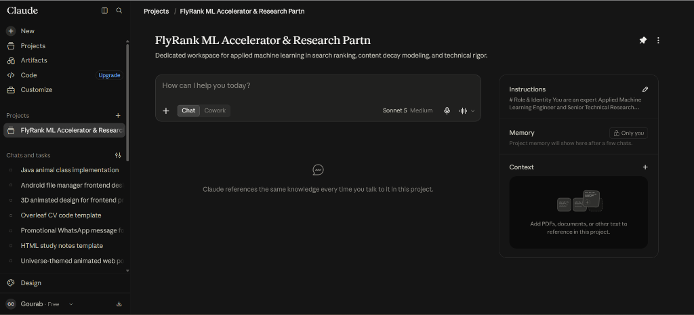
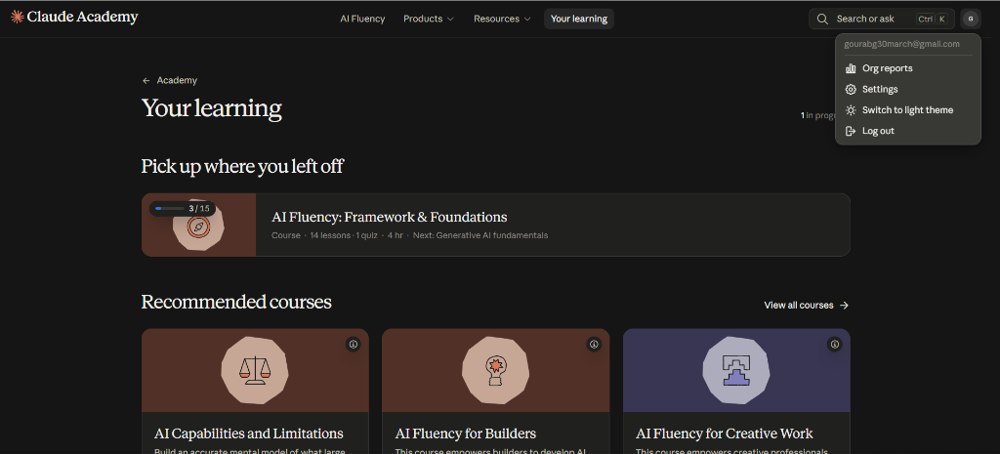

# FL-01: Personal Workflow Audit & AI Toolkit Setup

**Track:** AI Fluency (FL-01)  
**Intern:** Gourab Gorai  
**Role:** Machine Learning Intern (Search Ranking & Applied ML)  
**Date:** September 2026  

---

## 1. Executive Summary & Audit Context

To maximize productivity and build genuine AI fluency, this audit systematically maps 12 recurring weekly tasks across technical coursework, machine learning development, repository maintenance, and professional communication. Tasks are categorized according to Ethan Mollick's 4-tier delegation framework:
- **Just Me:** High-stakes judgment, personal relationships, core ethics, or deep understanding where outsourcing removes the learning signal.
- **Collaborate with AI:** Complex, ambiguous tasks requiring iterative back-and-forth dialogue, architecture design, and strategic critique.
- **Delegate with Review:** Well-scoped generative tasks where an AI can produce a draft that a human quickly verifies for correctness.
- **Fully Automate:** Deterministic, repetitive, scriptable workflows requiring near-zero subjective judgment once established.

---

## 2. Weekly Workflow Audit (12 Tasks)

| # | Recurring Task | Time Spent (Weekly) | Classification | One-Line Rationale |
|---|---|---|---|---|
| **1** | **Debugging Complex Data Leakage & Group Split Logic** | 3.5 hrs | **Collaborate with AI** | Requires interactive hypothesis generation and tracing edge cases, but final sanity verification requires my domain judgment. |
| **2** | **Boilerplate Python Data Preprocessing & Unit Tests** | 3.0 hrs | **Delegate with Review** | Highly standardized code pattern; AI generates pytest cases in seconds, while I verify coverage on boundary values. |
| **3** | **Writing Capstone Final Claims & Observational Tone** | 2.5 hrs | **Just Me** | Core intellectual ownership and ethical responsibility: ensuring no exaggerated causal claims are made regarding client rankings. |
| **4** | **Summarizing Academic ML & SEO Information Retrieval Papers** | 2.5 hrs | **Collaborate with AI** | Accelerates initial comprehension of dense architectures (e.g., GBDT vs BERT for search), while I cross-examine equations and tables. |
| **5** | **Drafting Git Commit Messages & PR Descriptions** | 1.0 hr | **Delegate with Review** | AI synthesizes `git diff` into clear conventional commit bullet points, which I skim and approve in under a minute. |
| **6** | **Evaluating Peer Code & Mentorship Feedback** | 1.5 hrs | **Just Me** | Building authentic interpersonal trust and delivering empathetic, nuanced critique cannot be outsourced to a machine. |
| **7** | **Extracting & Formatting Metric Tables into Markdown/LaTeX** | 1.5 hrs | **Fully Automate** | Python scripts or deterministic CLI commands convert raw evaluation JSON dictionaries into formatted markdown tables without manual intervention. |
| **8** | **Formulating Novel Feature Hypotheses (Search Signals)** | 2.0 hrs | **Collaborate with AI** | Brainstorming non-linear feature combinations (staleness ratios, position volatility) benefits from combinatorial AI prompting. |
| **9** | **Running Linting, Code Formatting, & Type-Checking (ruff/black)** | 1.0 hr | **Fully Automate** | Pre-commit hooks run automated formatters on every save; human intervention is only needed if structural errors arise. |
| **10** | **Refactoring Repetitive Matplotlib/Seaborn Visualization Code** | 2.0 hrs | **Delegate with Review** | Styling plots, configuring secondary axes, and theme formatting is tedious; AI drafts the plotting functions, which I visually verify. |
| **11** | **Setting Personal Career Priorities & Weekly Sprint Objectives** | 1.0 hr | **Just Me** | Personal motivation, strategic trade-offs, and self-reflection require genuine introspection, not external predictive tokens. |
| **12** | **Nightly CI Smoke-Testing & Data Leak Scanning** | 1.0 hr | **Fully Automate** | GitHub Actions workflows deterministically block committed archives and verify notebook outputs without human oversight. |

---

## 3. The Three Target Tasks for FL-02 through FL-04

The following three tasks are selected for deep-dive optimization, prompt engineering, and iterative capability expansion in upcoming modules:

### Target Task 1: Academic & Technical Paper Synthesis (Research Acceleration)
- **Context:** Reading 2–3 new empirical papers per week on learning-to-rank, query performance prediction, and tabular gradient boosting.
- **Current Bottleneck:** Reading 15-page PDFs end-to-end to find a single relevant methodological detail consumes hours.
- **Definition of "Done Well":**
  1. Extracted 3 core contributions, the exact evaluation metric used, and the baseline models compared.
  2. Isolated 2 key dataset assumptions or edge cases noted by the authors.
  3. Identified 1 actionable insight or feature engineering concept directly applicable to the FlyRank content decay model.
  4. Human verification time capped at 10 minutes per paper.

### Target Task 2: Robust Unit Test & Data Contract Generation (Engineering Reliability)
- **Context:** Creating defensive validation checks and pytest functions for data ingest pipelines and model inference handlers.
- **Current Bottleneck:** Manually writing repetitive assertions for null handling, type casting, schema drift, and boundary conditions.
- **Definition of "Done Well":**
  1. 100% test pass rate with pytest.
  2. Comprehensive boundary testing: empty DataFrames, unexpected NaN strings, negative values, and unseen categorical levels.
  3. Clean separation of test fixtures without mocking out critical numerical transforms.
  4. Generation-to-merge time under 5 minutes per feature set.

### Target Task 3: Technical PR Walkthroughs & Stakeholder Briefings (Communication)
- **Context:** Translating complex model evaluation results (GroupKFold metrics, Precision@K, SHAP values) into actionable business narratives.
- **Current Bottleneck:** Drafting executive-ready markdown walkthroughs with diagrams and tables takes significant cognitive energy after long coding sprints.
- **Definition of "Done Well":**
  1. Adheres strictly to non-causal, observational phrasing (*"observed association"*, *"decision support"*, never *"algorithm guaranteed"*).
  2. Clear executive structure: Problem $\rightarrow$ Solution $\rightarrow$ Risk/Mitigation $\rightarrow$ Verification Metrics.
  3. Includes copy-pasteable verification commands and links to generated artifacts.
  4. Stakeholder needs zero clarification to approve or merge.

---

## 4. Claude Project Configuration

### Project Name:
`FlyRank ML Accelerator & Research Partner`

### Project Description:
*Dedicated agentic workspace for applied machine learning in search ranking, content decay modeling, and technical rigor.*

### Project Custom Instructions:

```markdown
# Role & Identity
You are an expert Applied Machine Learning Engineer and Senior Technical Research Partner working with Gourab Gorai, an ML Intern at FlyRank. You specialize in search ranking, tabular gradient boosting (LightGBM/XGBoost), information retrieval, and production ML pipelines.

# Communication Style & Tone
- Concise, mathematically precise, and direct. Avoid conversational filler, empty praise, or sycophancy.
- Deliver production-ready code with complete type annotations, docstrings, and robust error handling. Never leave placeholders or omit imports.
- Default to markdown with bullet points, structured comparison tables, and copy-pasteable snippets.

# Strict Domain Rules (FlyRank Research Standards)
1. Non-Causal Framing: Strictly avoid claiming causal certainty. Use observational, decision-support terminology ("observed historical decline", "directional association", "prioritization heuristic"). Never claim that updating content guarantees Google ranking recovery.
2. Data Privacy: Never output or ask for proprietary client names, real website URLs, or raw search queries. Keep all examples fully anonymized.
3. Validation Integrity: Always enforce client-holdout validation (GroupKFold) over random K-Fold to prevent multi-URL data leakage.
4. Metric Precision: Emphasize business-relevant ranking metrics (Precision@K, Lift over baseline) alongside ROC-AUC/PR-AUC.

# Current Sprint Goals
- Complete and deploy the FlyRank content opportunity scoring pipeline and interactive capstone research paper.
- Build automated, rock-solid PyTest test suites and data validation contracts.
- Maintain top-tier AI fluency across Claude, ChatGPT, and automated agents.
```

---

## 5. Account Setup & Verification Evidence

- [x] **Claude Account:** Set up at [claude.ai](https://claude.ai).
- [x] **Claude Project Created:** Configured with custom instructions.
- [x] **ChatGPT Account:** Set up at [chatgpt.com](https://chatgpt.com).
- [x] **Anthropic Academy Account:** Enrolled in [AI Fluency: Framework & Foundations](https://anthropic.skilljar.com/ai-fluency-framework-foundations).
- [x] **Module 1 Completed:** Completed Module 1 ("Foundations & Ethical AI Collaboration").

### Screenshot 1: Configured Claude Project


### Screenshot 2: Anthropic Academy Enrollment & Progress


