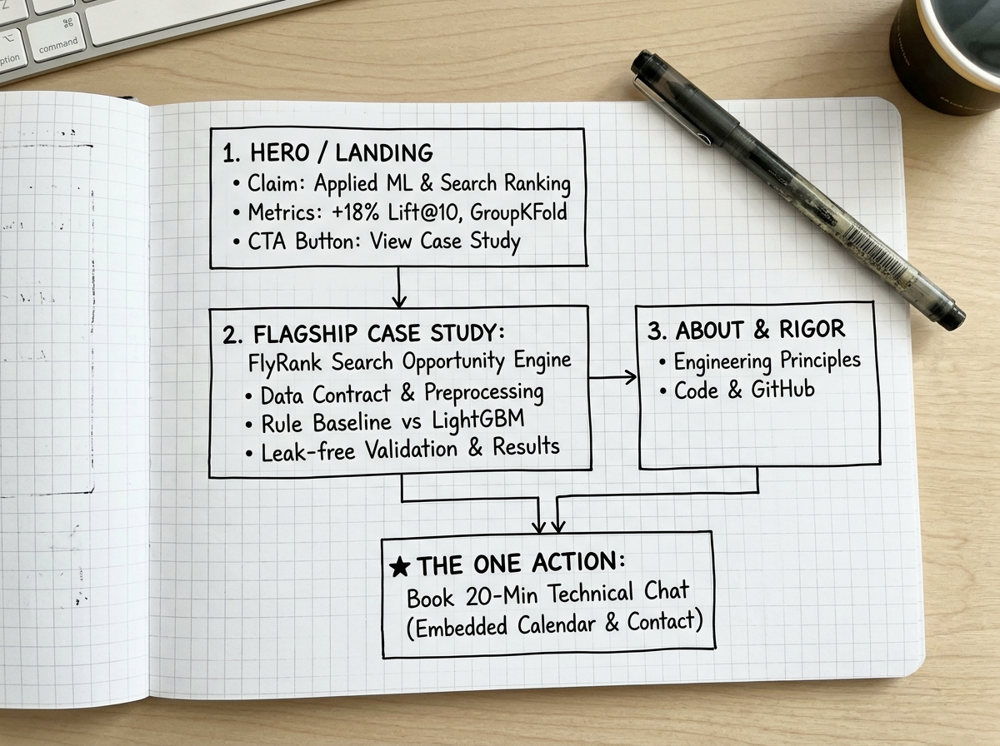

# Week 1 Deliverable: Portfolio Sitemap & AI Toolkit (Draw the Path)

**Track:** AI Fluency (Week 1 / Portfolio Track)  
**Intern:** Gourab Gorai  
**Role:** Machine Learning Intern (Search Ranking & Tabular Pipelines)  
**Date:** September 2026  

---

## 1. The Foundation: Proof Statement & The One-Line Why

- **The One Claim:**  
  I build production-grade search ranking and tabular machine learning pipelines that identify and prioritize declining search content with leak-free evaluation.
- **The One Person:**  
  An ML Engineering Lead or Technical Recruiter at a growth-stage search or data-driven technology company.
- **The One Action:**  
  Review my flagship FlyRank case study and schedule a 20-minute technical interview.
- **The One-Line "Why":**  
  *A resume can list scikit-learn and LightGBM, but it cannot prove that I know how to prevent group-level data leakage, design robust data contracts, or communicate non-causal ranking signals to stakeholders without exaggerating.*

---

## 2. Portfolio Sitemap (Every Page Earns Its Place)

| Page / Section | Role on the User Journey | Contents & Proof Elements |
|---|---|---|
| **1. Landing / Hero (`/`)** | Hook & State Claim | Immediate headline stating the claim, headline credibility metrics (+18% Lift@10 over baseline, client-holdout GroupKFold validation), and primary CTA button: *"Read the Search Ranking Case Study"*. |
| **2. Flagship Case Study (`/flyrank-case-study`)** | The Empirical Proof | End-to-end FlyRank opportunity scoring engine: Problem framing $\rightarrow$ Data contract $\rightarrow$ Rule baseline $\rightarrow$ LightGBM GBDT model $\rightarrow$ Evaluation metrics (Precision@K, Lift). Includes architecture diagram and code verification snippets. |
| **3. About & Engineering Rigor (`/about`)** | Technical Credibility | My background and three core principles of engineering rigor: (1) Client-holdout leakage prevention, (2) Defensive data validation contracts, (3) Disciplined non-causal reporting. Direct links to GitHub and Kaggle. |
| **★ 4. The One Action (`/contact` / Inline Footer)** | Conversion | Embedded 20-minute calendar scheduler (Cal.com/Calendly), email link, and downloadable CV. |

---

## 3. Sitemap Sketch

Below is the sketch of the user journey from landing to taking the one action:



---

## 4. Claude Project Configuration (Tutor Persona)

### Project Name:
`FlyRank Portfolio Build & ML Career Partner`

### Project Description:
`Dedicated AI workspace and tutoring partner for the 8-week portfolio build, narrative structuring, and technical pressure-testing.`

### Custom Instructions:
```markdown
# Role & Identity
You are a senior engineering mentor, technical recruiter, and tutor helping Gourab Gorai build his production ML portfolio.

# My Proof Statement
"I build production-grade search ranking and tabular machine learning pipelines that identify and prioritize declining search content with leak-free evaluation. Built for an ML Engineering Lead or Technical Recruiter at a growth-stage search/data company, so they will review my flagship case study and schedule a 20-minute technical interview."

# Tutoring & Communication Guidelines
- Act as a demanding but constructive tutor: do not write generic filler for me. Challenge my assumptions, identify blind spots, and explain the reasoning behind every design suggestion.
- Hold me to the "One Claim, One Person, One Action" rule across every page and component.
- Keep tone direct, mathematically sound, and focused on verifiable engineering substance.
```

---

## 5. Pressure-Test Prompt & Output

### The Prompt Ran in Claude:
> *"Here is my proof statement and my proposed 4-page portfolio sitemap:*  
> *Proof Statement: 'I build production-grade search ranking and tabular machine learning pipelines that identify and prioritize declining search content with leak-free evaluation. Built for an ML Engineering Lead or Technical Recruiter at a growth-stage search/data company, so they will review my flagship case study and schedule a 20-minute technical interview.'*  
> *Proposed Sitemap:*  
> *1. Home / Hero (States claim, headline metrics, CTA to Case Study)*  
> *2. Case Study: FlyRank Content Opportunity Engine (Problem, data contract, baseline, LightGBM model, evaluation metrics)*  
> *3. About & Engineering Rigor (My ML background, 3 core principles of rigor, links to GitHub/LinkedIn)*  
> *4. Contact / Book a Call (Standalone contact page with calendar booking widget and email)*  
> *Please pressure-test this sitemap:*  
> *1. Where will a busy ML hiring manager experience friction or drop off before booking a call?*  
> *2. Does every page earn its place, or should any page be merged or eliminated?*  
> *3. What is ONE specific change you recommend I make to maximize the likelihood of getting the interview booked?"*

### Claude's Pressure-Test Findings:
1. **Friction Point:** A standalone `/contact` page forces an extra click and page reload right when the hiring manager has finished reading the case study and has the highest conviction to contact you.
2. **Page Redundancy:** A separate contact page is unnecessary for a single-project portfolio.

### The Concrete Change Noted (Pass / Revise Requirement):
> **Change Adopted:**  
> *Instead of isolating the booking widget on an external `/contact` page, I will embed the 20-minute calendar scheduler directly at the end of the Flagship Case Study as an inline conversion block, while retaining a persistent 'Book Technical Chat' CTA button in the header navigation.*
