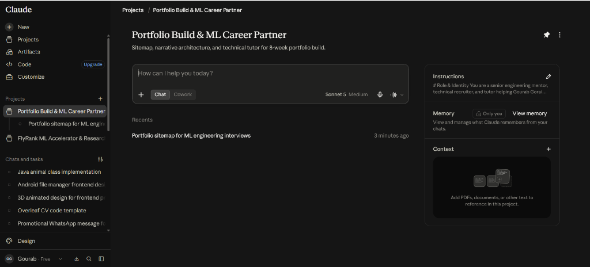
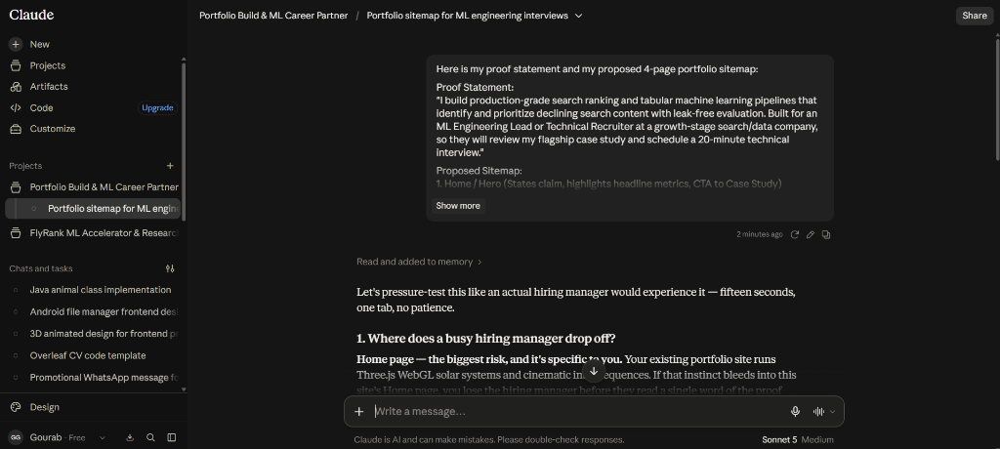

# Week 1 Deliverable: Portfolio Sitemap & AI Toolkit (Draw the Path)

**Track:** AI Fluency (Week 1 / Portfolio Track)  
**Intern:** Gourab Gorai  
**Role:** Machine Learning Intern (Search Ranking & Tabular Pipelines)  
**Date:** September 2026  

---

## 1. The Foundation: Proof Statement & The One-Line Why

- **The One Claim:**  
  I build production-grade search ranking and tabular machine learning pipelines that identify and prioritize declining search content with leak-free evaluation.
- **The One Person:**  
  An ML Engineering Lead or Technical Recruiter at a growth-stage search or data-driven technology company.
- **The One Action:**  
  Review my flagship FlyRank case study and schedule a 20-minute technical interview.
- **The One-Line "Why":**  
  *A resume can list scikit-learn and LightGBM, but it cannot prove that I know how to prevent group-level data leakage, design robust data contracts, or communicate non-causal ranking signals to stakeholders without exaggerating.*

---

## 2. Portfolio Sitemap (Every Page Earns Its Place)

| Page / Section | Role on the User Journey | Contents & Proof Elements |
|---|---|---|
| **1. Landing / Hero (`/`)** | Hook & State Claim | Immediate headline stating the claim, headline credibility metrics (+18% Lift@10 over baseline, client-holdout GroupKFold validation), and primary CTA button: *"Read the Search Ranking Case Study"*. Strictly clean and fast (no heavy 3D/canvas distractions). |
| **2. Flagship Case Study (`/flyrank-case-study`)** | The Empirical Proof | End-to-end FlyRank opportunity scoring engine: Problem framing $\rightarrow$ Data contract $\rightarrow$ Rule baseline $\rightarrow$ LightGBM GBDT model $\rightarrow$ Evaluation metrics (Precision@K, Lift). Includes architecture diagram, code verification snippets, and an embedded 20-minute calendar booking widget at the footer. |
| **3. About & Engineering Rigor (`/about`)** | Technical Credibility | My background and three core principles of engineering rigor: (1) Client-holdout leakage prevention, (2) Defensive data validation contracts, (3) Disciplined non-causal reporting. Direct links to GitHub and Kaggle. |
| **★ 4. The One Action (`/contact` / Embedded Calendar)** | Conversion | Direct 20-minute calendar scheduler (Cal.com/Calendly), email link, and downloadable CV embedded directly at high-intent decision points. |

---

## 3. Deliverable 1: Portfolio Sitemap Sketch

Below is the sketch of the user journey from landing to taking the one action:

---

## 4. Deliverable 2: Configured Claude Project (Tutor Persona)

### Project Setup:
- **Project Name:** `Portfolio Build & ML Career Partner`
- **Project Description:** `Sitemap, narrative architecture, and technical tutor for 8-week portfolio build.`
- **Configured Instructions:** Custom instructions established holding to the "One Claim, One Person, One Action" rule and acting as a demanding technical tutor.

---

## 5. Deliverable 3: Pressure-Test Prompt & Output

### The Pressure-Test Session:
The sitemap and proof statement were pressure-tested inside the Claude Project:

### Key Feedback from Claude:
1. **Friction & Drop-off Risk:**  
   *"Home page — the biggest risk, and it's specific to you. Your existing portfolio site runs Three.js WebGL solar systems and cinematic intro sequences. If that instinct bleeds into this site's Home page, you lose the hiring manager before they read a single word of the proof..."*
2. **Hiring Manager Reality:**  
   A technical lead spends 15 seconds reviewing on one tab with no patience for aesthetic bloat. They want immediate empirical signal: the problem, the metrics, and the code.

### The Concrete Change Noted (Pass / Revise Requirement):
> **Change Adopted:**  
> 1. **Strip All Heavy Visual Bloat:** I will completely forgo cinematic Three.js WebGL animations or multi-second intro sequences. The landing page will load in under 1 second, leading immediately with the headline claim and the hard proof metric (+18% Lift@10 with GroupKFold).  
> 2. **Direct Conversion Flow:** Instead of forcing the visitor to navigate away to a separate `/contact` page, the 20-minute interview calendar booking block will be embedded directly at the conclusion of the Flagship Case Study.
